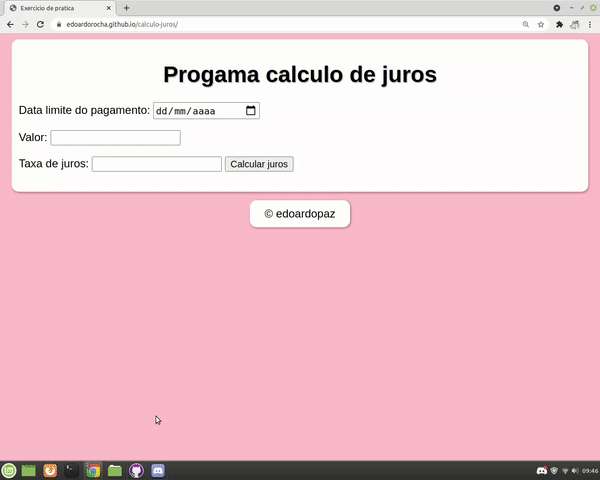

<h1 align="center"> Interest-calculation </h1>
 
 
 
 
 
 
 

 
 
 > status: Developing ⚠️
 
 
 
 ## How to use this algorithm?

1. First enter the payment date
     + Remembering that the date must be before the current system date 
3. Then enter the payment amount
4. Finally enter the interest rate and click on the button to calculate the interest

## What does this algorithm consist of?

Basically this algorithm consists of taking a date, an amount and an interest rate. It ends the algorithm by calculating and handing you the interest to be supposedly "Paid"

## Technologies used

<table> 
 <tr>
  <td>JavaScript</td>
  <td>HTML</td>
  <td>CSS</td>
 </tr>
 <tr> 
  <td> ECMAS v8.0</td>
  <td> v5.0 </td>
  <td>v3.0</td>
 </tr>
</table>

## License
Repository covered by [MIT](http://escolhaumalicenca.com.br/licencas/mit/) license
